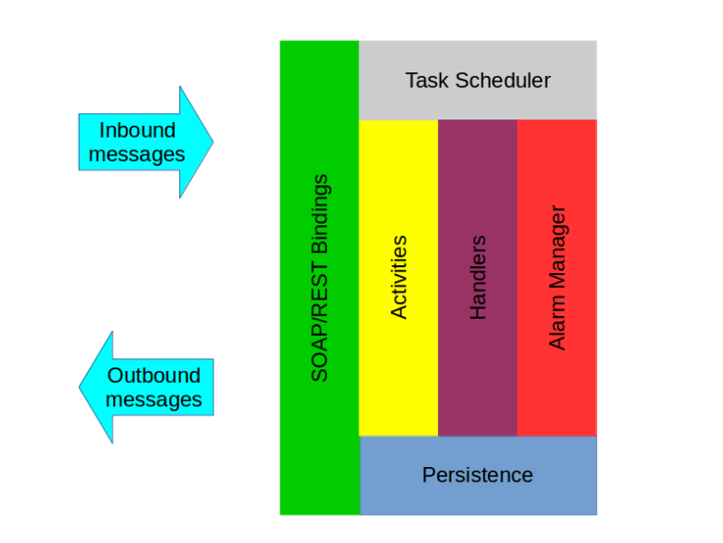

# High Level Overview

Hydra consists of two main components: a transformer tool that generates the WS-BPEL process engine application, and a runtime library that is used by the generated application. In addition to the main aim of this project, to produce a system that can generate bespoke BPEL engine applications, there are a few others that it would be good to highlight here:

* One aim is to make use of standardised APIs as much as possible. This makes it easy to plug in alternative implementations when necessary.

* Another aim is to maximise code reuse through the use of existing open-source software, where possible.

* Yet another aim is to provide an implementation that maximises concurrency at runtime. It also is as efficient as possible when it comes to efficient usage of the heap during XML processing.

You will find these aims reflected in the discussion below.

## Concepts

Before we dive into the details of the overview it would be helpful to introduce a few concepts that may make understanding the details a bit easier:

* *Process instance:* The state, i.e. variables, partner links, correlation sets, etc., associated with a process running in the engine. There can be multiple process instances being executed by the engine simultaneously.

* *Activity state:* The state associated with each activity in the process, i.e. Initial, Ready, Active, etc.. Also forms a part of the process instance state. The <scope> activity holds the activity state for every activity nested within it, including itself. There will only be an entry if the activity has started, is about to start. A list of all of the activity states across all of the <scope> activities will yield a snapshot of the flow of processing for the process instance, at that point in time.

* *Scope context:* The instantiation of the process instance state, but only for the activities nested within a particular <scope>. The scope context use by the <process> instance does represent the entire process instance state.

* *Synthetic activity:* During the transformation process certain activities may be added to the final workflow that were not present in the original process description. An example of when we may need to do this is when we transform the special <invoke> syntax that allows handlers to an equivalent internal representation whereby the <invoke> is wrapped in a <scope> activity. In this scenario the extra <scope> activity is considered to be a synthetic activity.

## Transformer tool

The transformer takes the WS-BPEL process description, along with all associated WSDLs and XSDs, and transforms them into an application over a number of phases. Currently there are four phases. The first phase is the *setup* phase. In this phase we take the input(s) provided on the command line and prepare them for use by the following phases.

The second phase is *validation*. This consists of both XML Schema validation of the WS_BPEL process description itself, and all associated WSDLs; and also static-analysis, based on Schematron schemas. The validation phase is an optional one that can be skipped, if necessary.

The third phase is the *transformation* phase where the code for the application is generated. Most of the code is already provided by the runtime library, discussed below, so that no actual code generation is necessary, except in certain scenarios such as the usage of WS-BPEL 2.0 message correlation(s) in the process description. This phase mainly generates Spring configuration in order to create and manage the Java instances that will be needed to execute the process flow.

The final phase is the *packaging* phase. In this phase we gather all of the artifacts that were produced in the previous transformation phase and build and package them, using embedded maven, into an application suitable for deployment. By default, this packaging phase produces a Web Application Archive (WAR).

For further details see the Javadoc.

## Runtime library

The Hydra runtime library provides support to the generated application, produced by the transformer tool. A diagram highlighting the relationship between theses components is shown bellow: 

The components identified include:

* Task Scheduler

  * This is the component responsible for managing process flow of a process instance. The activity implementations (described below) create a `Task` instance, which contains details such as the id of the activity instance, and the id of the process instance. The task is passed to the scheduler where it is added to a queue. The queue is managed by a number of worker threads that remove tasks from the queue and use the details added to the task to retrieve the the correct activity instance and scope context in order to be able to process the task.

* Activity Implementation

  * This component provides implementations of the activities defined in the WS-BPEL 2.0 specification. There will be one activity implementation for each type of activity supported by WS_BPEL 2.0, and one instance of that activity type for each corresponding activity described in the process description. These instances are managed by Spring. Actually, some of those activity instances may not represent an activity described in the process description. Instead, they may in fact be synthetic activities. Technically the <process> instance is not an activity, however, it is included as a part of this component.
  
  * The work of the activity implementations is achieved largely via use of the Saxon HE processor. Saxon HE is an XML Schema unaware XPATH 2.0 and XSLT 2.0 processor. It also provides support for XPATH 1.0 and XSLT 1.0 via backwards compatibility modes. Do note, however, that even in backwards compatibility there can still be some behavioural differences when compared to a genuine XPATH 1.0 and XSLT 1.0 processor, which conflicts with the requirements of the WS-BPEL 2.0 specification. An alternative would be to delegate to something like Apache Xalan, but that remains to be decided.
  
  * As Saxon HE is XML Schema unaware, we must delegate to the Apache Xerces parser for all operations that require XML Schema validation.
  
  * We do not make use of the Java API for XML Processing (JAXP), except for interactions with the Apache Xerces parser, as it has not yet been modified to support the new capabilities of XPATH 2.0 and XSLT 2.0. Hopefully the situation will change in the future.
  
  * This component relies heavily on the Persistence component.
  
* Handler Implementation

  * This component provides implementations of the handlers, i.e. event, fault, compensation, termination, supported by a <scope> activity.
  
  * This component relies heavily on the Persistence component.
  
  * The handler instances are also managed by Spring.

* Alarm Manager

  * This component provides support for persistent timers needed to support the business process.
  
  * This component is closely linked to the Persistence component.
  
  * The alarm manager instance is also managed by Spring.

* Persistence

  * This component is responsible for persisting, and retrieving, the state associated with the WS-BPEL process instance to, and from, a database.. All persistence tasks are delegated to an ORM framework that supports the Java Persistence API (JPA) 2.1 specification. 

* SOAP Bindings

  * Most of the SOAP binding support is provided via the Java API for XML Web Services (JAX-WS). There are some limited features, however, that are not yet supported by JAX-WS, e.g. asynchronous provider support. In order to support these that will require the use of some proprietary Apache CXF extensions.
  
  * The default SOAP binding will be SOAP/HTTP, but we do hope to also provide support for SOAP/JMS as an alternative.
  
  * The instances of the SOAP bindings are also managed by Spring.
  
* REST Bindings

  * We aim to support our own REST bindings for WS-BPEL as a proprietary extension. It is possible that this would also be based on Apache CXF as it provides good support for Java API for RESTful Web Services (JAX-RS), but this has not been decided yet.
    
  * The instances of the REST bindings are also managed by Spring.
  
For further details see the Javadoc.

## Process flow

In this section we describe how the runtime components, described above, actually work together to implement a workflow.

The first thing to understand is that the state for a process instance is held entirely in the database. As far as the activity implementations are concerned, they are entirely stateless with regards to the process instance state, and must first retrieve this from the database, via interaction with the persistence component.

The next thing to understand is that the activity implementations are free to modify not only their own state, but also the state of any activity that is a part of the same process instance state. For the most part activity implementations simply manage their own state, however, there are occasions where are activity will need to modify the state of another activity. This includes includes occasions when an activity will need to modify the activity state of another activity in order to implement termination or exiting behaviour, or when an isolated scope ends and it's state needs to be shared again. The state associated with other process instances that may be present is completely unaffected.

In order to manage any changes to activity state, either for your own or for a different activity, all activity implementations include a customised state transition table that allows an activity implementation to lookup the next valid state for the target activity, given the combination of the current state of the target activity and an event that has just occurred. The activity can then update the activity state of the target activity, based on the activity state that is returned by the state transition table.

In order to manage any changes to the process instance state then we must use the concurrency management mechanisms provided by JPA 2.1.

  * For objects that already exist and that need to be updated we must first obtain an `OPTIMISTIC_FORCE_INCREMENT` lock in order to prevent two threads from updating the same object. This is because one thread will always succeeds while the other thread will be forced to rollback, due to an `OptimisticLockException`. This allows us to maximise concurrency through the system, while still allowing us to provide appropriate safety guarantees.
  
  * For objects that do not yet exist, and need to be added to the database we design the primary key appropriately to ensure that one thread always succeeds while the other thread is forced to rollback due to a `EntityExistsException`.
  
For the more rare occasions where we need to prevent other activities from making further updates, for example during termination or exiting behaviour then we must use an alternative to optimistic locking

  * For objects that already exist and that need to be updated we must first obtain an `PESSIMISTIC_FORCE_INCREMENT` lock in order to prevent two threads from updating the same object. This is because one thread will always succeeds while the other thread will be forced to rollback, due to an `PessimisticLockException`.

## Examples

In order to clarify the process flow even further we provide a number of explicit examples to demonstrate how the components work together.
